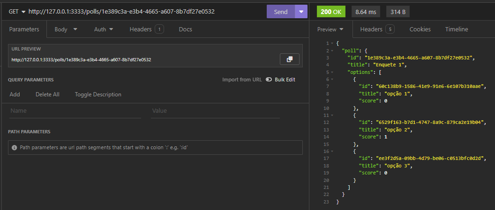

<p align="center">
  <h1>Sistema de votação</h1>
</p>

<p align="center">
  <a href="#-tecnologias">Tecnologias</a>&nbsp;&nbsp;&nbsp;|&nbsp;&nbsp;&nbsp;
  <a href="#-projeto">Projeto</a>&nbsp;&nbsp;&nbsp;|&nbsp;&nbsp;&nbsp;
  <a href="#-Como executar">Como executar</a>
</p>

<p align="center">
  
</p>


<br>

## 🚀 Tecnologias

Esse projeto foi desenvolvido com as seguintes tecnologias:

- typescript
- dotenv
- fastify
- @fastify/cookie
- @fastify/websocket
- @prisma/client
- http-status-codes
- ioredis
- zod
- Docker
- Docker compose

## 💻 Projeto

Um sistema de votação em tempo real onde os usuários podem criar uma enquete e outros usuários podem votar. O sistema gera um ranking entre as opções e atualiza os votos em tempo real.

## 🚀 Como executar

- Clone o repositório
- Modifique as envs
- Suba os serviços do Postgres e Redis
- Rode yarn para baixar as dependências
- Rode yarn prisma:migrate para iniciar a parte de migrations do banco de dados
- Rode yarn build para buildar o projeto para javascript
- Rode yarn start para inicar a aplicação
- Por fim, a aplicação estará disponível em http://localhost:3333
 
## 🚀 Como executar com docker compose

- Clone o repositório
- Rode docker compose up -d
- Por fim, a aplicação estará disponível em http://localhost:3333

## 🚀 HTTP

### POST `/polls`

Crie uma nova enquete.

#### Request body

```json
{
  "title": "Qual a melhor linguagem de programação?",
  "options": [
    "JavaScript",
    "Java",
    "PHP",
    "C#"
  ]
}
```

#### Response body

```json
{
  "pollId": "194cef63-2ccf-46a3-aad1-aa94b2bc89b0"
}
```

### GET `/polls/:pollId`

Retorne dados de uma única enquete.

#### Response body

```json
{
	"poll": {
		"id": "e4365599-0205-4429-9808-ea1f94062a5f",
		"title": "Qual a melhor linguagem de programação?",
		"options": [
			{
				"id": "4af3fca1-91dc-4c2d-b6aa-897ad5042c84",
				"title": "JavaScript",
				"score": 1
			},
			{
				"id": "780b8e25-a40e-4301-ab32-77ebf8c79da8",
				"title": "Java",
				"score": 0
			},
			{
				"id": "539fa272-152b-478f-9f53-8472cddb7491",
				"title": "PHP",
				"score": 0
			},
			{
				"id": "ca1d4af3-347a-4d77-b08b-528b181fe80e",
				"title": "C#",
				"score": 0
			}
		]
	}
}
```

### POST `/polls/:pollId/votes`

Adicione um voto a uma enquete específica.

#### Request body

```json
{
  "pollOptionId": "31cca9dc-15da-44d4-ad7f-12b86610fe98"
}
```

## 🚀 WebSockets

### ws `/polls/:pollId/results`

#### Mensagem

```json
{
  "pollOptionId": "da9601cc-0b58-4395-8865-113cbdc42089",
  "votes": 2
}
```


---

Feito com ♥ by Lincoln silva :wave: